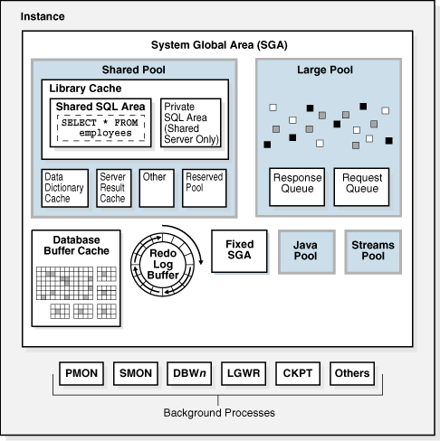
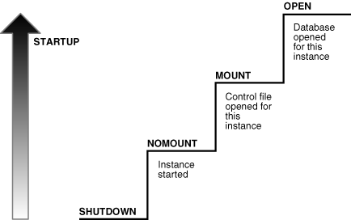

### Oracle 体系结构 

### Oracle 启动过程

### 内存结构
- SGA
    - shared pool
    - database buffer cache
    - redo log buffer
- PGA
- UGA
    - 共享服务器连接,UGA包含在SAG中
    - 专有服务器连接，UGA就包含在专有服务器的PGA中

### 进程结构
- 用户进程
- 服务器进程
- 进程监控`PMON`
- 系统监控`SMON`
- 数据写入`DBWR`
- 日志写入`LGWR`
- 检查点进程`CKPT`
- 归档进程`ARCH`
- 

### 物理结构
- 数据文件
- 控制文件
- 重做日志文件
- 归档日志文件
- 参数文件
    - pfile
    - spfile
- 监听文件
- 报警和跟踪日志

### 逻辑结构
- 表空间`tablespace`
- 段`segment`
- 区`extent`
- 块`block`

