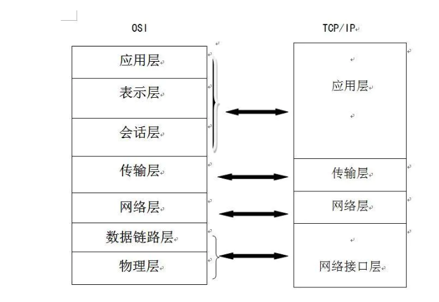
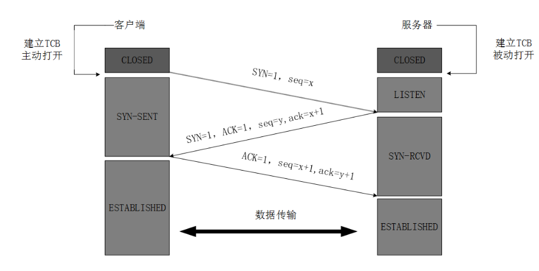
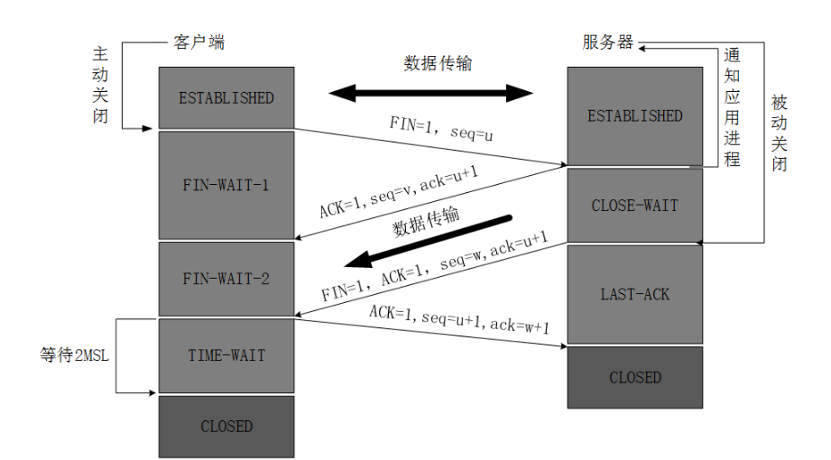

## python 

## MySQL 

## Oracle 

## MongoDB 

## Flink 

## K8s 

## Network
### TCP 三次握手和四次挥手
TCP/IP协议族: 
- tcp 传输控制协议 - 一种面向连接的、可靠的、基于字节流的传输层通信协议
- ip 网际协议 - 用于封包交换数据网络的协议
- TCP/IP协议不仅仅指的是TCP 和IP两个协议，而是指一个由FTP、SMTP、TCP、UDP、IP等协议构成的协议簇

#### OSI

#### 三次握手

#### 四次挥手

### HTTP和HTTPS区别
- https是http协议的安全版本,http协议的数据传输是明文的，是不安全的，https使用ssl/tls协议进行了加密处理，相对安全
- http使用默认端口是80, https使用默认端口是443
- https由于涉及到措辞握手，因此性能比较差
- https需要ssl证书

## 反问面试
- 团队里面初级和高级工程师的比例是多少（有计划改变吗）
- 每个开发者/员工有多大的自由来做出决定
- 在你看来，这个工作做到什么程度算成功
- 不同的意见如何处理
- 如果有人注意到了在流程或者技术等其他方面有改进的地方，怎么办
- 公司的资金来源是什么?谁影响或者制定高层计划或方向?
- 该职位为何会空缺?
- 公司如何保证人才不流失?
- 这份工作 / 团队 / 公司最好和最坏的方面是
- 你最开始为什么选择了这家公司
- 你为什么留在这家公司
- 如果有奖金计划的话，奖金如何分配?过去的几年里通常会发百分之多少的奖金?
- 